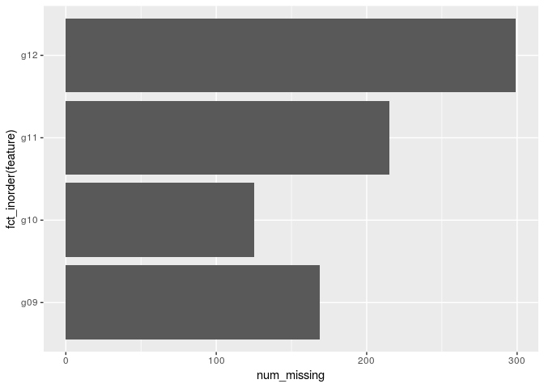
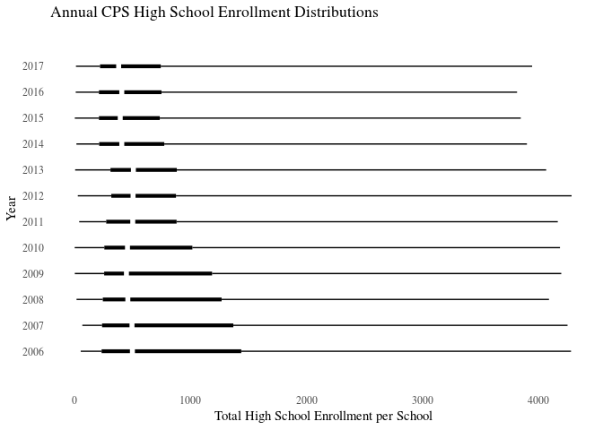

A CPS Enrollment Dataset
================
Charlotte Mack
November 16, 2018

NB: This document is under construction! Comments are welcome.

This repository contains exploratory analysis and visualizations of enrollment data that were extracted from Chicago Public Schools (CPS) public records. The prepared data are available at this repository in Rds and csv formats; at present there are only high school data, with elementary school data forthcoming. The sets span the school years from 2006--2007 through 2017--2018, and will be periodically updated.

A glimpse of the high schools data:

    ## Observations: 1,914
    ## Variables: 10
    ## $ govern      <fct> regular, regular, regular, regular, regular, regul...
    ## $ school_id   <int> 610245, 609695, 609696, 610402, 609708, 609716, 60...
    ## $ common_name <chr> "Douglass HS", "Amundsen HS", "Austin HS", "DeVry ...
    ## $ year        <dbl> 2006, 2006, 2006, 2006, 2006, 2006, 2006, 2006, 20...
    ## $ total       <int> 737, 1500, 580, 223, 1738, 1694, 1439, 4278, 1936,...
    ## $ total_hs    <dbl> 384, 1500, 580, 223, 1738, 1694, 1439, 4278, 1936,...
    ## $ g09         <int> 215, 435, NA, NA, 606, 510, 513, 1103, 578, 254, 2...
    ## $ g10         <int> 119, 438, NA, NA, 504, 419, 331, 945, 546, 254, 30...
    ## $ g11         <int> 50, 361, 367, 107, 380, 371, 291, 1230, 403, NA, 2...
    ## $ g12         <int> NA, 266, 213, 116, 248, 394, 304, 1000, 409, NA, 2...

Visualization of the structure, using DataExplorer package:

``` r
library(DataExplorer)
plot_str(enrollment)
```

Number of schools represented in the data: 247

Number of schools for which there are data for all years in the period:

    ## [1] 86

Missing observations could be a key feature of the CPS enrollment dataset in some applications, because many of them are not generated randomly but as a result of the entry and exit of schools from the CPS roster. These processes often result in grades being phased in or out at the transitioning school. The next few exhibits concern missing points on some or all data where the school does have a record for the year. The case not considered at the moment is truncation when a school does not exist for some years --a form of hidden missing observations so to speak.

Aggregate numbers of missing observations, by grade: 

Missing grade observations by year, counts:


Missing grade observations by year, as a fraction of all for that year: 

Boxplot overview of high school enrollment distribution by year: 

Notes
=====

The original CPS data are available in a series of spreadsheets at [CPS website.](http://www.cps.edu/SchoolData/Pages/SchoolData.aspx)[1] Downloadable data files that I have prepared are in this repository with Rds and csv extensions. The Rds files, which are used in R language programming, may have some type designations that are not in the csv files, but there should be no other difference.

[1] Membership data are under the heading "Demographics."
