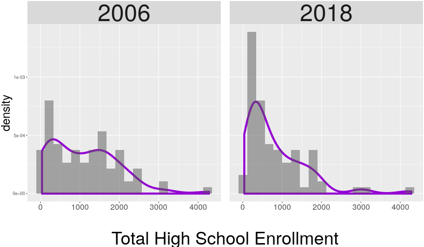

Shifts in Enrollment Distribution   among Chicago High Schools:  Insights from reshaping CPS data
========================================================
author: Charlotte Mack
date: April 27th, 2019
autosize: true

Motivations
========================================================

- Sharply declining enrollments in Harlan & Hirsch High schools

- Closing of [the historic DuSable High School](https://en.wikipedia.org/wiki/DuSable_High_School), August 2006. Alumni and teaching staff include
    - Harold Washington, Margaret Burroughs
    - Dinah Washington, Gene Ammons, Nat "King" Cole, Johnny Griffin, Eddie Harris, Walter Dyett ...
    - Don Cornelius, Redd Foxx

Chicago Public School (CPS) data
========================================================

- Sample data spans **2006** through **2018**

- Includes all schools under the Chicago Public School District
    - Public Schools
    - Charter Schools
    - Contract Schools
    
- Updated data in R-ready form is available at [CPSenrollment](https://github.com/cymack/CPSenrollment) and in the data package [CPSenrollpack](https://github.com/cymack/CPSenrollpack), both at github.com.

A Tidy CPS Dataset: 84 obs per year
========================================================

- Data set head

<table class="table" style="margin-left: auto; margin-right: auto;">
<caption>84 Schools per year</caption>
 <thead>
  <tr>
   <th style="text-align:left;"> common_name </th>
   <th style="text-align:right;"> year </th>
   <th style="text-align:right;"> total_hs </th>
  </tr>
 </thead>
<tbody>
  <tr>
   <td style="text-align:left;"> ACE Tech Chtr </td>
   <td style="text-align:right;"> 2006 </td>
   <td style="text-align:right;"> 272 </td>
  </tr>
  <tr>
   <td style="text-align:left;"> ACE Tech Chtr </td>
   <td style="text-align:right;"> 2018 </td>
   <td style="text-align:right;"> 315 </td>
  </tr>
  <tr>
   <td style="text-align:left;"> Amundsen </td>
   <td style="text-align:right;"> 2006 </td>
   <td style="text-align:right;"> 1500 </td>
  </tr>
  <tr>
   <td style="text-align:left;"> Amundsen </td>
   <td style="text-align:right;"> 2018 </td>
   <td style="text-align:right;"> 1226 </td>
  </tr>
</tbody>
</table>
- Data set tail
<table class="table" style="margin-left: auto; margin-right: auto;">
<caption>84 Schools per year</caption>
 <thead>
  <tr>
   <th style="text-align:center;"> common_name </th>
   <th style="text-align:center;"> year </th>
   <th style="text-align:center;"> total_hs </th>
  </tr>
 </thead>
<tbody>
  <tr>
   <td style="text-align:center;"> York Alt </td>
   <td style="text-align:center;"> 2006 </td>
   <td style="text-align:center;"> 354 </td>
  </tr>
  <tr>
   <td style="text-align:center;"> York Alt </td>
   <td style="text-align:center;"> 2018 </td>
   <td style="text-align:center;"> 210 </td>
  </tr>
  <tr>
   <td style="text-align:center;"> Young Magnet </td>
   <td style="text-align:center;"> 2006 </td>
   <td style="text-align:center;"> 1901 </td>
  </tr>
  <tr>
   <td style="text-align:center;"> Young Magnet </td>
   <td style="text-align:center;"> 2018 </td>
   <td style="text-align:center;"> 1915 </td>
  </tr>
</tbody>
</table>

Change in Enrollment Distributions
========================================================


```r
talk_dat %>% ggplot(aes(x = total_hs, y = ..density..)) + facet_wrap(~ year) 
```



Un-tidying for a Side-by-side View
========================================================

```r
ranked <- talk_dat %>% spread(year, total_hs)
```


<table class="table" style="margin-left: auto; margin-right: auto;">
 <thead>
  <tr>
   <th style="text-align:center;"> common_name </th>
   <th style="text-align:center;"> rank_06 </th>
   <th style="text-align:center;"> rank_18 </th>
  </tr>
 </thead>
<tbody>
  <tr>
   <td style="text-align:center;"> Lane Tech </td>
   <td style="text-align:center;"> 1 </td>
   <td style="text-align:center;"> 1 </td>
  </tr>
  <tr>
   <td style="text-align:center;"> Kelly </td>
   <td style="text-align:center;"> 2 </td>
   <td style="text-align:center;"> 6 </td>
  </tr>
  <tr>
   <td style="text-align:center;"> Curie </td>
   <td style="text-align:center;"> 3 </td>
   <td style="text-align:center;"> 3 </td>
  </tr>
  <tr>
   <td style="text-align:center;"> Schurz </td>
   <td style="text-align:center;"> 4 </td>
   <td style="text-align:center;"> 9 </td>
  </tr>
  <tr>
   <td style="text-align:center;"> Taft </td>
   <td style="text-align:center;"> 5 </td>
   <td style="text-align:center;"> 2 </td>
  </tr>
  <tr>
   <td style="text-align:center;"> Farragut </td>
   <td style="text-align:center;"> 6 </td>
   <td style="text-align:center;"> 37 </td>
  </tr>
  <tr>
   <td style="text-align:center;"> Clemente </td>
   <td style="text-align:center;"> 7 </td>
   <td style="text-align:center;"> 34 </td>
  </tr>
  <tr>
   <td style="text-align:center;"> Lincoln Park </td>
   <td style="text-align:center;"> 8 </td>
   <td style="text-align:center;"> 4 </td>
  </tr>
  <tr>
   <td style="text-align:center;"> Steinmetz </td>
   <td style="text-align:center;"> 9 </td>
   <td style="text-align:center;"> 20 </td>
  </tr>
  <tr>
   <td style="text-align:center;"> Bogan Tech </td>
   <td style="text-align:center;"> 10 </td>
   <td style="text-align:center;"> 33 </td>
  </tr>
</tbody>
</table>


Re-tidying to Plot a Side-by-side View
========================================================

<small>

```r
ranked %>% filter(rank_06 <= 15)  %>% 
    mutate(common_name = 
               fct_reorder(common_name, rank_06, median)) %>%
    select(-c(starts_with("hs"), govern)) %>% 
    gather(key = rank_yr, 
           value = ranking, 
           -common_name) %>%
   
    ggplot(aes(x = fct_rev(common_name), 
               y = ranking, 
               color = rank_yr)) + 
    geom_point(position = position_jitter(width = 0, height = 0.6)) +
    coord_flip() + 
    geom_path(aes(group = common_name), 
              lineend = "butt", 
              linejoin = "mitre", 
              arrow = grid::arrow(angle = 15, 
                                  length = unit(.2, "cm"), 
                                  ends = "last", 
                                  type = "closed"))
```
</small>

The Final Plot
========================================================

