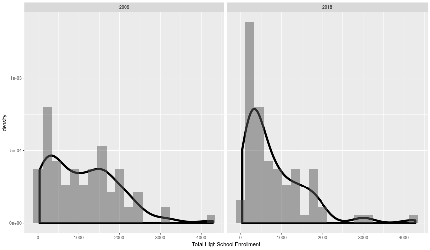
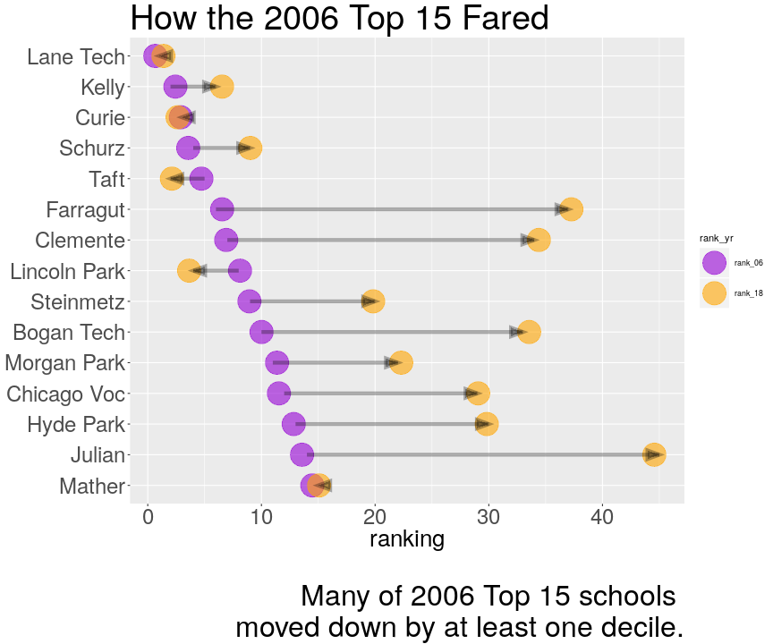

Reshape Your Data to the  Grammar of Your Graphics
========================================================
author: Charlotte Mack
date: April 24, 2019
autosize: true


A Tidy Dataset
========================================================


```
# A tibble: 6 x 3
  common_name       year total_hs
  <chr>            <dbl>    <dbl>
1 ACE Tech Chtr HS  2006      272
2 ACE Tech Chtr HS  2018      315
3 Amundsen HS       2006     1500
4 Amundsen HS       2018     1226
5 Bogan Tech HS     2006     2119
6 Bogan Tech HS     2018      781
```

```
# A tibble: 2 x 2
# Groups:   year [2]
   year     n
  <dbl> <int>
1  2006    84
2  2018    84
```

Standard plots are easy with tidy data
========================================================

```r
talk_dat %>% ggplot(aes(x = total_hs, y = ..density..)) + facet_wrap(~ year) 
```



Un-tidying for a Side-by-side View
========================================================

```r
ranked <- talk_dat %>% spread(year, total_hs)
```


```
# A tibble: 84 x 4
   govern  common_name     rank_06 rank_18
   <chr>   <chr>             <dbl>   <dbl>
 1 regular Lane Tech HS          1       1
 2 regular Kelly HS              2       6
 3 regular Curie HS              3       3
 4 regular Schurz HS             4       9
 5 regular Taft HS               5       2
 6 regular Farragut HS           6      37
 7 regular Clemente HS           7      34
 8 regular Lincoln Park HS       8       4
 9 regular Steinmetz HS          9      20
10 regular Bogan Tech HS        10      33
# … with 74 more rows
```

Re-tidying to Plot a Side-by-side View
========================================================

<small>

```r
ranked %>% filter(rank_06 <= 15)  %>% 
    mutate(common_name = 
               fct_reorder(common_name, rank_06, median)) %>%
    select(-c(starts_with("hs"), govern)) %>% 
    gather(key = rank_yr, 
           value = ranking, 
           -common_name) %>%
    ggplot(aes(x = fct_rev(common_name), 
               y = ranking, 
               color = rank_yr)) + 
    geom_point(position = position_jitter(width = 0, height = 0.6)) +
    coord_flip() + 
    geom_path(aes(group = common_name), 
              lineend = "butt", 
              linejoin = "mitre", 
              arrow = grid::arrow(angle = 15, 
                                  length = unit(.2, "cm"), 
                                  ends = "last", 
                                  type = "closed"))
```
</small>

The Final Plot
========================================================

