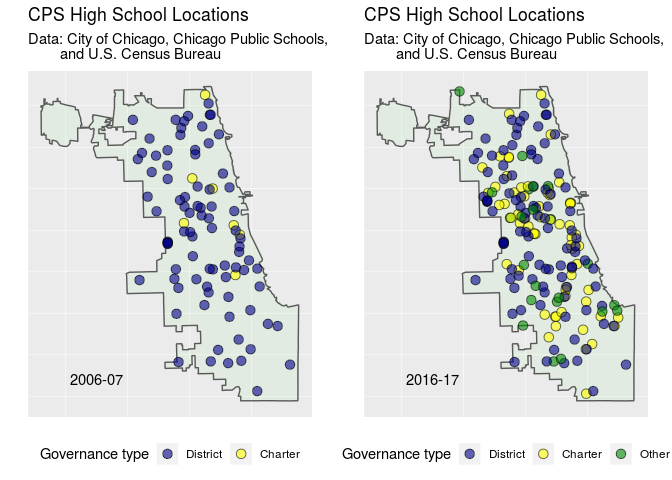

School Locations, 2006 and 2016
================
Charlotte Mack
2019-01-12

We use maps to show changes in distribution of regular district, charter district, and other types of high schools in the Chicago Public School district between 2006 and 2016.

``` r
p1 <- lmapper(school_loc_merged.2006, "2006-07") + labs_lmap + theme_lmap
p2 <- lmapper(school_loc_merged.2016, "2016-17") + labs_lmap + theme_lmap
gridExtra::grid.arrange(p1, p2, ncol = 2)
```


